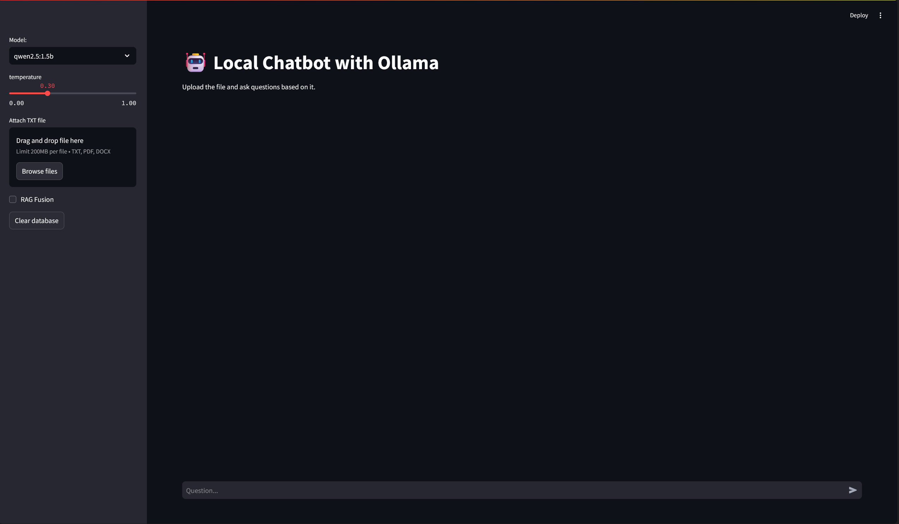
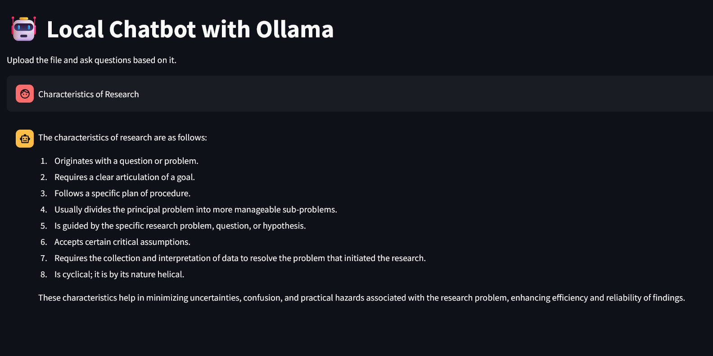

# MVPLLM

A streamlit-based chatbot application that uses Ollama for local language model inference and RAG (Retrieval Augmented Generation) capabilities. The application supports document upload (PDF, DOCX, TXT) and allows users to ask questions based on the uploaded content.

## 🚀 Features

- Local LLM inference using Ollama
- Support for multiple document formats (PDF, DOCX, TXT)
- RAG (Retrieval Augmented Generation) implementation
- RAG Fusion for improved response quality
- Adjustable temperature settings
- Interactive chat interface
- Document chunk management with ChromaDB
- Local embedding generation

## 📋 Requirements

Create a virtual environment and install the required packages:

```bash
python -m venv venv
source venv/bin/activate  # On Windows: .\venv\Scripts\activate
pip install -r requirements.txt
```

Contents of `requirements.txt`:
```
streamlit
langchain
langchain-community
chromadb
```

## 🛠️ Installation

1. First, install Ollama by following the instructions at [Ollama's official website](https://ollama.ai/).

2. Clone this repository:
```bash
git clone https://github.com/Onanore/MVPLLM.git
cd MVPLLM
```

3. Install the required Python packages:
```bash
pip install -r requirements.txt
```

4. Pull the required Ollama models:
```bash
ollama pull qwen2.5:1.5b
ollama pull deepseek-r1:1.5b
ollama pull mxbai-embed-large
```

## 💻 Usage

1. Start the Streamlit application:
```bash
streamlit run app.py
```

2. Access the application through your web browser (typically at `http://localhost:8501`)

3. Use the sidebar to:
   - Select the desired Ollama model
   - Adjust the temperature setting
   - Upload documents
   - Toggle RAG Fusion
   - Clear the vector database

4. Start chatting! Ask questions about your uploaded documents.

## 📸 Demo Screenshots


*Main chat interface with model selection and document upload*


*Example of RAG-based response generation*

## 📝 Example Usage

1. Document Upload and Basic Query:
```
User: *Uploads a technical PDF document*
User: "What are the main topics covered in the document?"
Assistant: *Provides a summary based on the document content*
```

2. Using RAG Fusion:
```
User: *Enables RAG Fusion in sidebar*
User: "Can you explain the relationship between X and Y mentioned in section 3?"
Assistant: *Provides a detailed response with information from multiple relevant sections*
```

## 🔍 Project Structure
```
streamlit-chat-app/
├── README.md
├── requirements.txt
├── License
├── img/
├    ├── 1.png
├    └── 2.png
└── src/
    ├── data/          # Folder for temporary storage of uploaded PDF/DOCX files
    ├── app.py         # Main Streamlit application
    ├── database.py    # Document processing and ChromaDB management
    ├── embedding.py   # Embedding generation using Ollama
    └── queries.py     # RAG and RAG Fusion implementation
```

### Important Note About File Handling
When uploading PDF or DOCX files, they need to be stored temporarily for processing.

1. The application will automatically handle file uploads to this directory.
2. Files in this directory are used for temporary storage during document processing.
3. You can clear this directory periodically as needed, as the processed content is stored in the vector database.


## ⚠️ Notes

- Ensure Ollama is running in the background before starting the application
- Large documents may take some time to process during upload
- The vector database is stored locally in the `chroma_db` directory
